# Save TOMMY

This mini-game has 5 different levels which you can also add as many as you like. The level generation is automatic and by random, you just need to define the size of the tiles.

### Menu
- Controll over sounds
- Three pre-defined screen resolutions and "Fullscreen" mode

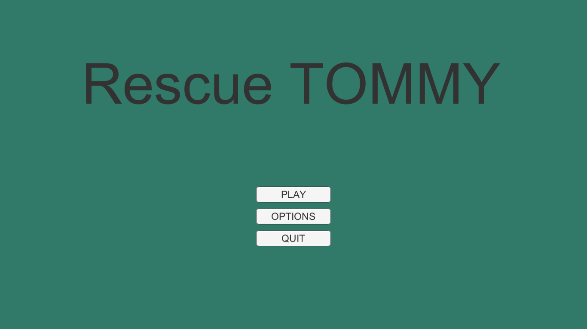
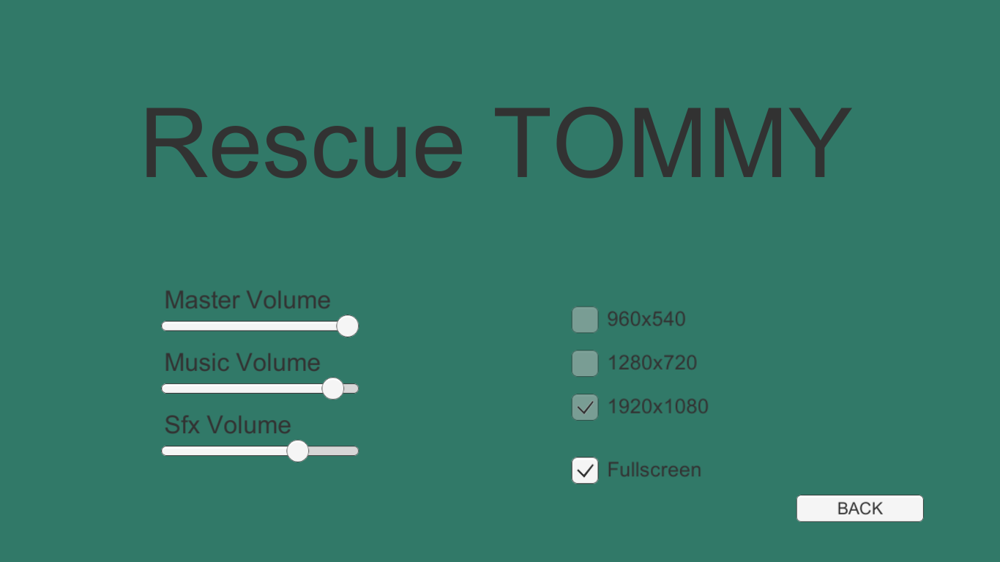

### Levels
- Aim and shoot by mouse
- Move with W/S/A/D keys
- Skip level by pressing "Enter"

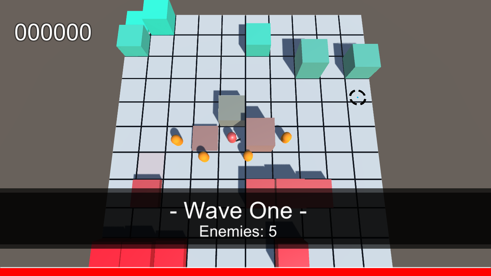
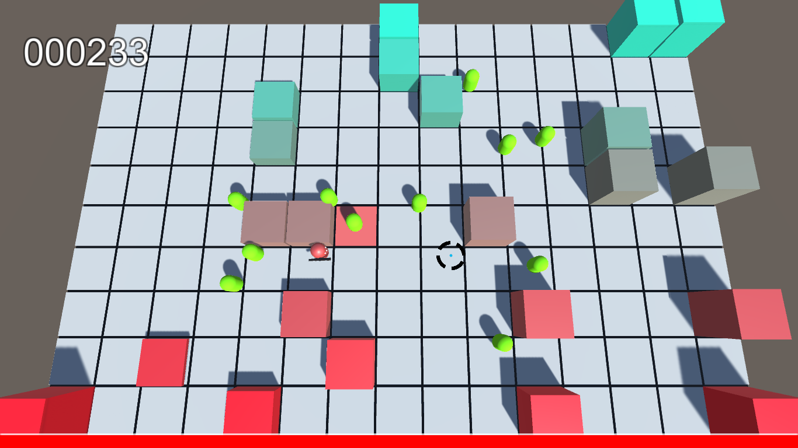
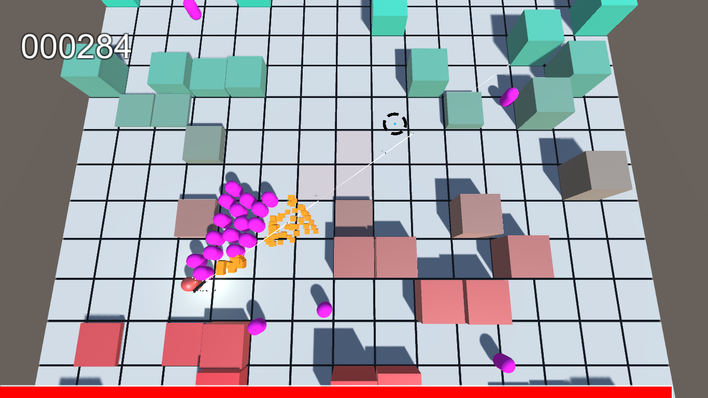
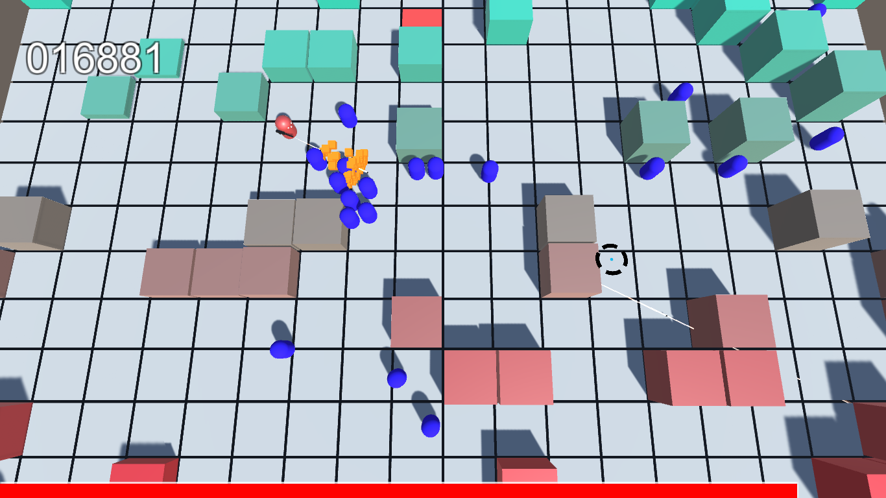
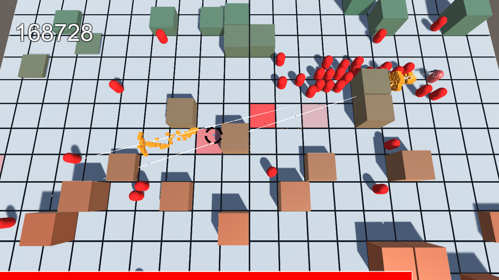

### Guns
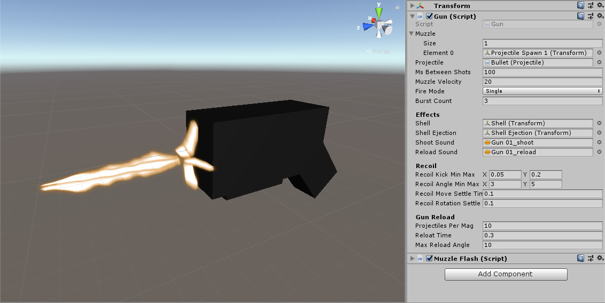

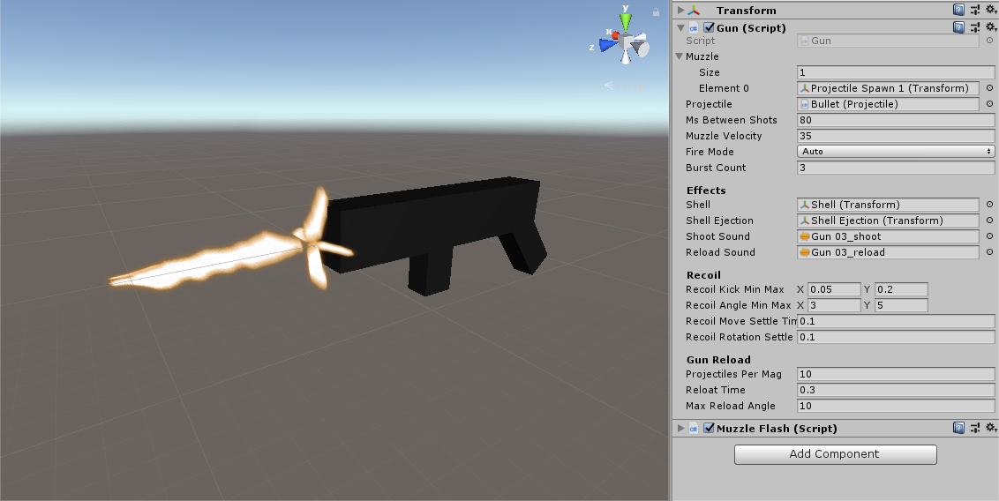
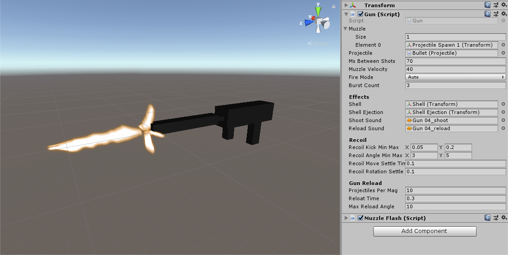
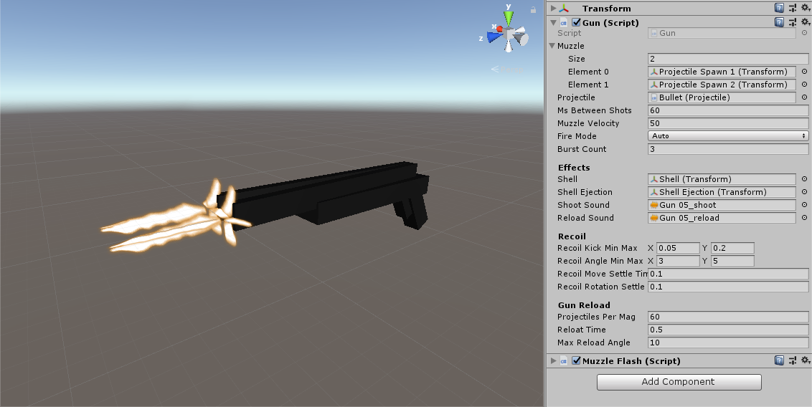

### Technical Features
- 🔰 Object Oriented Programming 
- 🧐 AI-based enemies (Nav Mesh Agent)
- ⚡ Live-mode level generation and modification
- ✅ Unlimited level generation with color and random obstacles
- ✅ Unlimited enemy generation with unique characteristics
- 🔫 5 different guns with unique characteristics
- Code-based animations
	- Enemy's Attack
	- Gun's kicks
	- New enemy wave banner
- ✨ And many more awesome features

#### Other
Idea and tutorial by [Sebastian Lague](https://www.youtube.com/watch?v=SviIeTt2_Lc&list=PLFt_AvWsXl0ctd4dgE1F8g3uec4zKNRV0&index=1) ([Source code in Github](https://github.com/SebLague/Create-a-Game-Source))